# ny_taxi_project - Analisis de Movilidad NYC
Autor: Andres Proano

## 1. Arquitectura (Bronze/Silver/Gold) + diagrama textual
El proyecto utiliza una arquitectura de datos en capas (Bronze, Silver, Gold) para garantizar la trazabilidad y calidad de la informacion.

Diagrama textual:
API NYC Taxi (Parquet) -> Mage (Ingestion) -> PostgreSQL (Bronze: raw_trips) -> dbt (Silver: Limpieza) -> dbt (Gold: Fact/Dims) -> Analisis (Python/SQL)

## 2. Tabla de cobertura por mes y servicio
Datos procesados correspondientes del ano 2022 al ano 2025 para ambos servicios:

- Servicio Yellow: Enero a Diciembre 2024 (Completo).
- Servicio Green: Enero a Diciembre 2024 (Completo).

Se presenta un resumen de ejemplo de cómo se visualizan las tablas:

| year_month | service_type | status | row_count |
| :---: | :---: | :---: | :---: |
| 2025-12 | yellow | missing | 0 |
| 2025-12 | green | missing | 0 |
| 2024-12 | yellow | loaded | 3668371 |
| 2024-12 | green | loaded | 53994 |

Resumen de tablas donde se observa todo el año 2024 cargado y fechas faltantes:

<details>
	<summary>Ver tabla de cobertura 1</summary>
	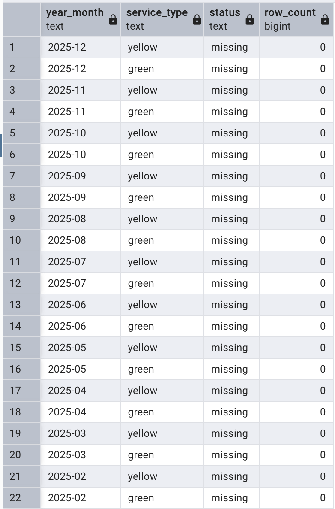
</details>

<details>
	<summary>Ver tabla de cobertura 2</summary>
	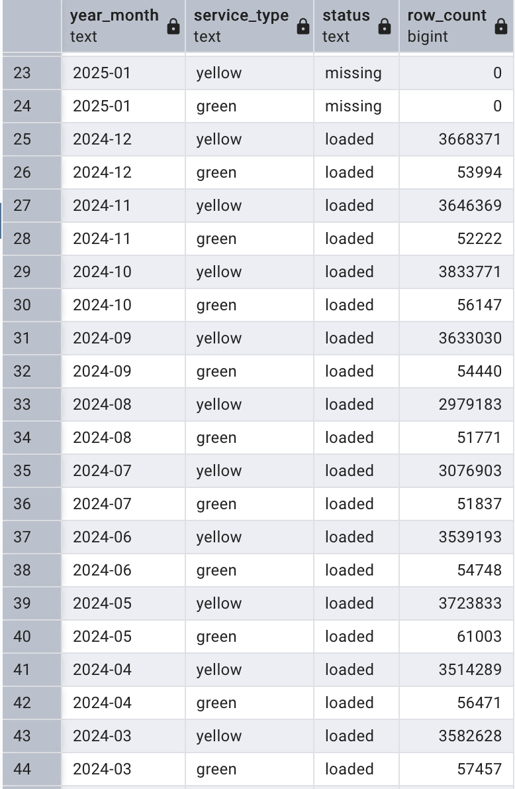
</details>

<details>
	<summary>Ver tabla de cobertura 3</summary>
	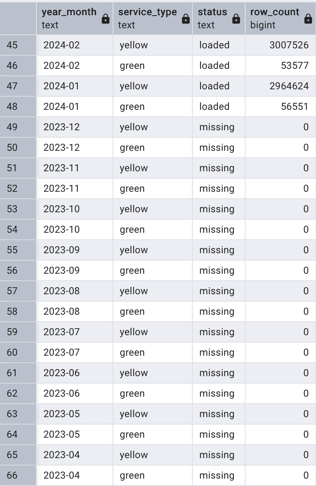
</details>

<details>
	<summary>Ver tabla de cobertura 4</summary>
	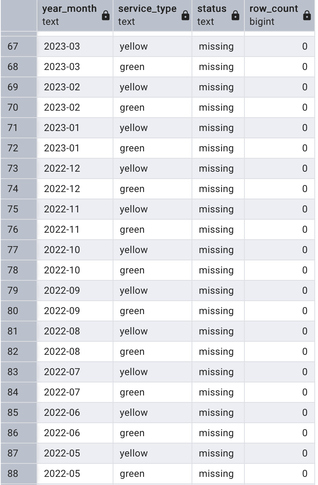
</details>

<details>
	<summary>Ver tabla de cobertura 5</summary>
	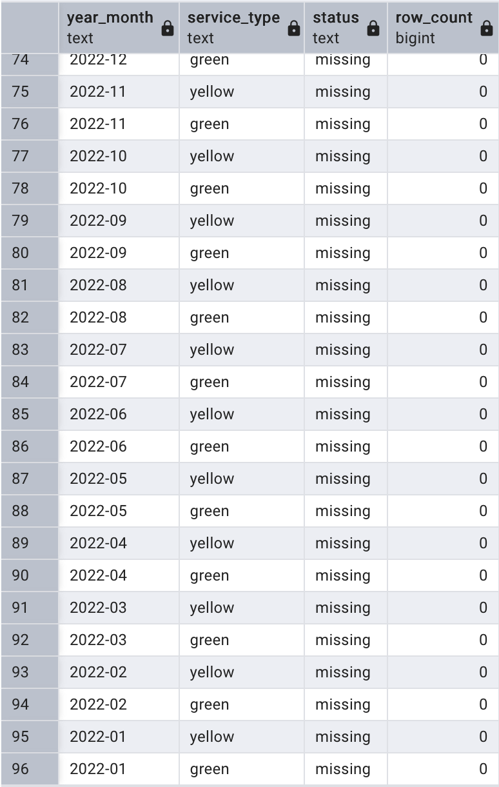
</details>

## 3. Como levantar el stack (docker compose up)
El entorno esta containerizado con Docker para asegurar la portabilidad.

```bash
docker compose up -d
```

Accesos:
- Mage: http://localhost:6789
- Postgres: localhost:5432

## 4. Mage pipelines y que hace cada uno
- load_nyc_data: Realiza la extraccion de archivos Parquet desde la API oficial de NYC y los carga en la capa Bronze. Implementa logica de idempotencia con borrado previo por mes/servicio.
- dbt_pipeline: Orquestador de transformaciones que ejecuta los modelos de dbt para transformar los datos de Bronze a Gold.

Log de ejecucion exitoso con meses finales de 2024:

<details>
	<summary>Ver log de carga (carga_datos.png)</summary>
	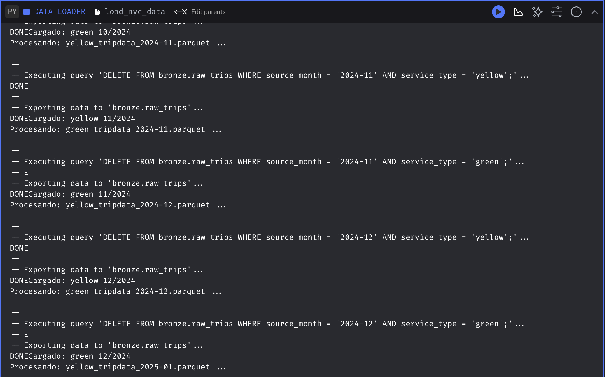
</details>

## 5. Triggers y que disparan
- ingest_monthly (Schedule): Ejecuta la ingesta de datos con frecuencia diaria para capturar los nuevos reportes de taxi.
- dbt_after_ingest (API/Event): Dispara la logica de transformacion dbt (en el orden build_silver, build_gold y quality_checks) inmediatamente despues de que la ingesta Bronze termina exitosamente.

Evidencias de triggers utilizados:

<details>
	<summary>Ver triggers (triggers.png)</summary>
	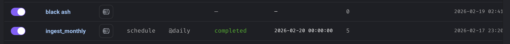
</details>

Donde ingest_monthly llama a todo el set para ejecutarse en el ultimo mes y finalmente otro trigger black ash que ejecuta todo el codigo despues de tener el llamado del primer trigger:

<details>
	<summary>Ver trigger monthly (montly_trigger.png)</summary>
	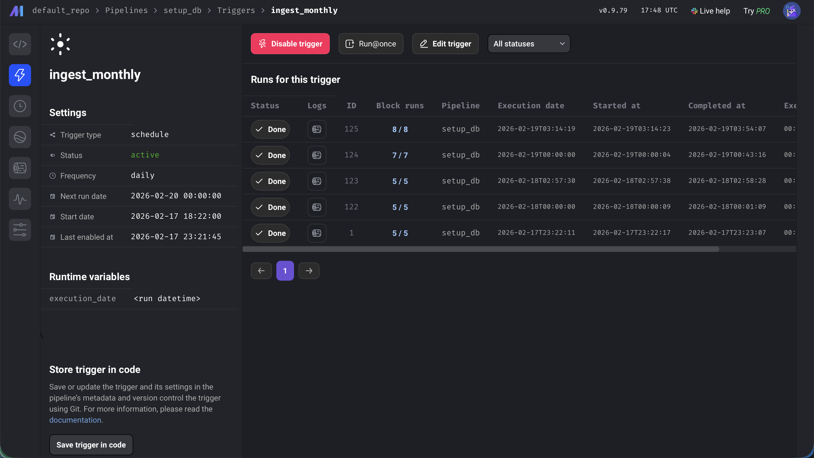
</details>

<details>
	<summary>Ver trigger black ash (blackash.png)</summary>
	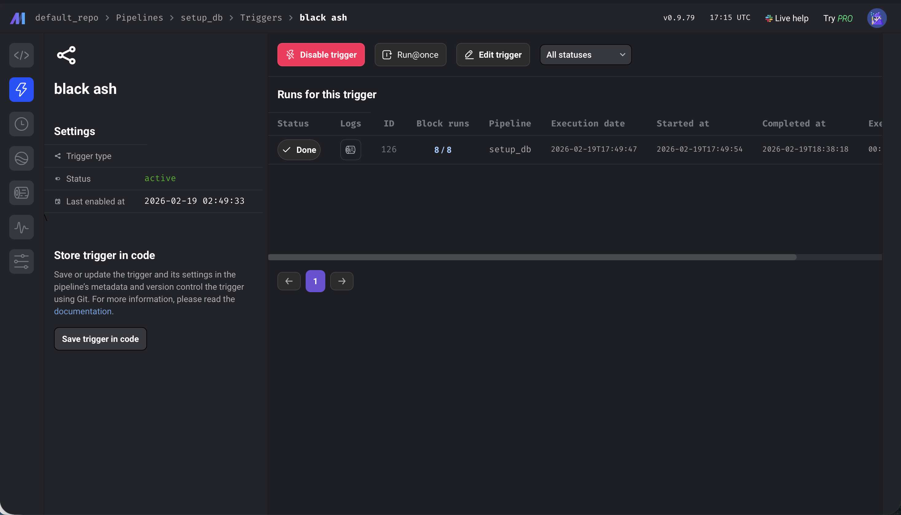
</details>

## 6. Gestion de secretos (nombres y proposito, sin valores)
Se utiliza el archivo io_config.yaml para manejar las credenciales. Tambien se incluye un archivo .env.example con la estructura necesaria para que el docker-compose pueda ser ejecutado.

- POSTGRES_USER: Usuario de la base de datos.
- POSTGRES_PASSWORD: Contrasena de acceso.
- POSTGRES_DB: Nombre de la base de datos de analitica.

Secretos encriptados (evidencia):

<details>
	<summary>Ver secretos (secrets.png)</summary>
	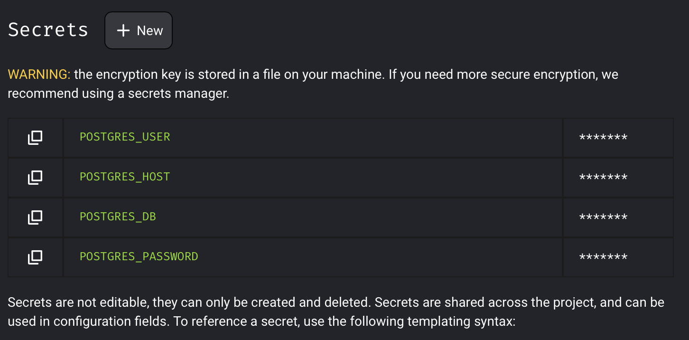
</details>

## 7. Particionamiento (evidencias VD+ y EXPLAIN)
Se implemento particionamiento por mes en la tabla de hechos para optimizar consultas.

Evidencia VD+ (partition pruning):

<details>
	<summary>Ver evidencia de particionamiento (PartitionedTable.png)</summary>
	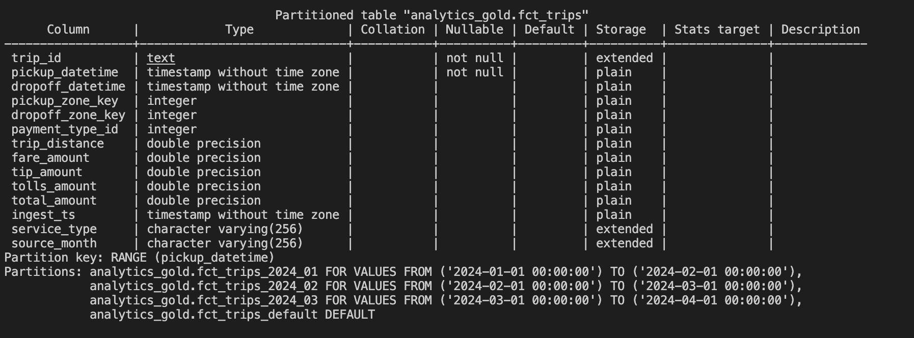
</details>

Observacion: en el plan de ejecucion con filtro por mes, el optimizador de PostgreSQL realiza un escaneo exclusivo sobre la particion hija correspondiente (ej. fct_trips_2024_01) en lugar de recorrer la tabla maestra. Esto reduce los costos de I/O y el tiempo de respuesta al ignorar segmentos irrelevantes para el filtro temporal aplicado.

Consulta 1: Filtro por mes en fct_trips

```sql
EXPLAIN (ANALYZE, BUFFERS)
SELECT * FROM analytics_gold.fct_trips
WHERE pickup_datetime >= '2024-01-01' AND pickup_datetime < '2024-02-01';
```

Evidencia EXPLAIN (ANALYZE, BUFFERS):

<details>
	<summary>Ver EXPLAIN fct_trips (fct_trips.png)</summary>
	
</details>

Consulta 2: Busqueda por zone_key

```sql
EXPLAIN (ANALYZE, BUFFERS)
SELECT * FROM analytics_gold.dim_zone WHERE zone_key = 1;
```

Evidencia EXPLAIN (ANALYZE, BUFFERS):

<details>
	<summary>Ver EXPLAIN dim_zone (dim_zone.png)</summary>
	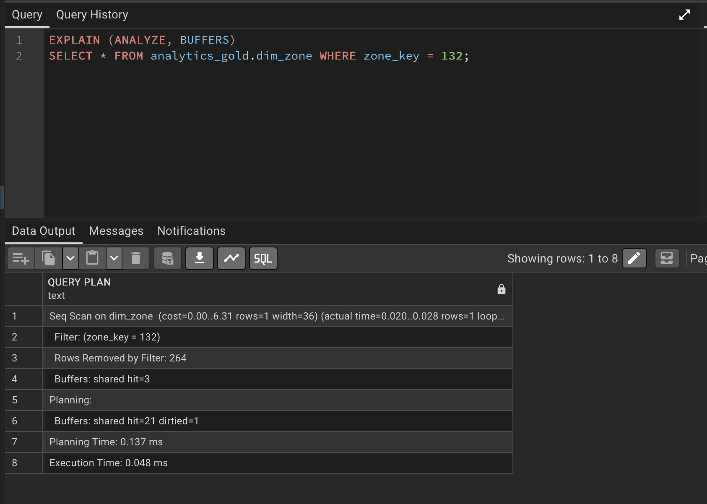
</details>

## 8. dbt
Materializaciones: Se utilizan table para dimensiones pequenas y se recomienda incremental para la tabla de hechos en produccion.

Logs de ejecucion:

<details>
	<summary>Ver log dbt run (8.2proof.png)</summary>
	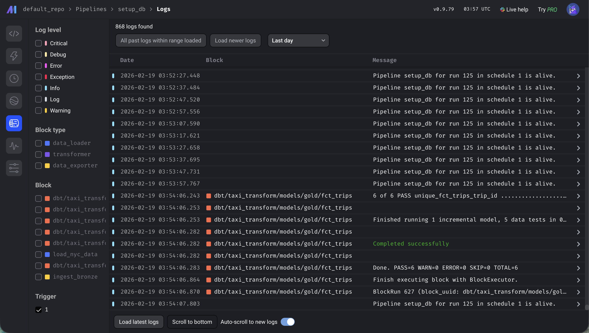
</details>

<details>
	<summary>Ver log dbt test (8.2prooftest.png)</summary>
	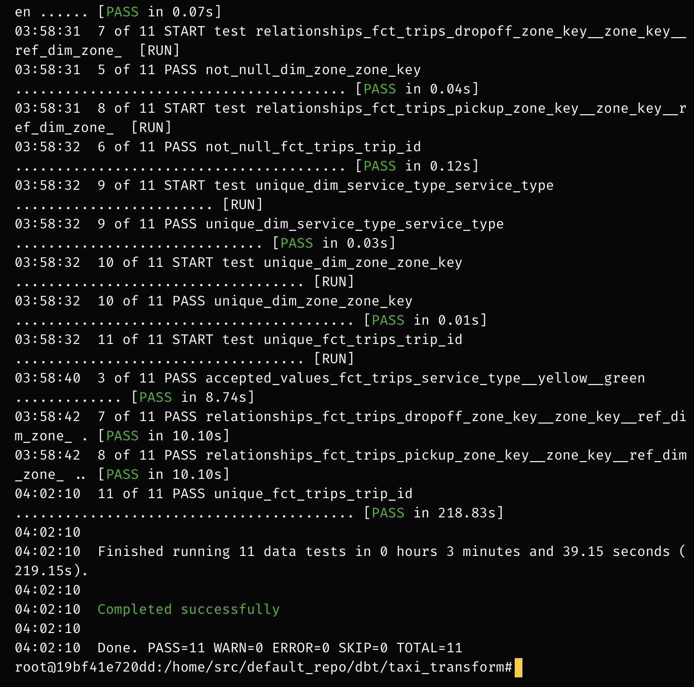
</details>

## 9. Troubleshooting 
- Outliers en Propinas: Se detectaron propinas superiores al 500% en zonas como Newark. Solucion: Filtrar registros con fare_amount > 5.0 y rate_code = 1 en la capa Silver.
- Velocidades Imposibles: Registros con velocidades de 2000+ MPH. Solucion: Aplicar filtros de calidad en dbt para excluir viajes con duraciones de 0 segundos.
- Memoria en Docker: Archivos Parquet pesados saturan el contenedor. Solucion: Implementar lectura por chunks en el Data Loader de Mage.


